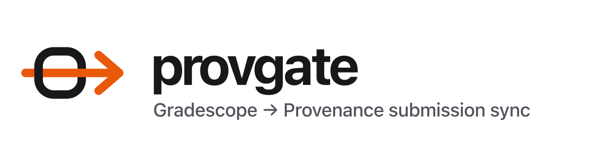
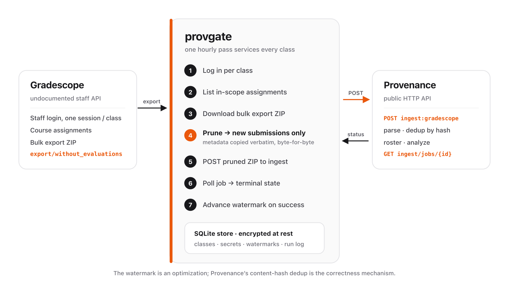

<picture>
  <source media="(prefers-color-scheme: dark)" srcset="brand/exports/lockup-dark.png" />
  
</picture>

**`provgate`** syncs newly-submitted student work from **[Gradescope](https://www.gradescope.com)** into a **[Provenance](https://github.com/itsgeagle/provenance)** server on a schedule.

Students record their work with the Provenance recorder and upload the resulting bundle to Gradescope as their submission. `provgate` runs on a schedule, pulls each configured assignment's new submissions out of Gradescope, and forwards them to Provenance's ingest API — so course staff get provenance analysis without anyone manually downloading and re-uploading exports. It is a **multi-class** manager: register any number of classes, each with its own Gradescope login and target Provenance semester, and one pass services all of them.

It is a **pure HTTP client of Provenance's public API** — it holds no Provenance code, database, or storage, and authenticates with an ordinary Provenance API token like any third-party tool.

## How it works

<picture>
  <source media="(prefers-color-scheme: dark)" srcset="brand/exports/architecture-dark.png" />
  
</picture>

The Gradescope bulk export (`…/assignments/{id}/export/without_evaluations`) is already in the exact shape Provenance's `ingest:gradescope` endpoint expects — a `submission_metadata.yml` plus one folder per submission — so no reformatting is needed. Each pass, `provgate` only *filters* the export down to the submissions it hasn't sent yet, copying the metadata byte-for-byte and keeping only new submission folders. Already-synced submissions simply drop out of the pruned ZIP.

## Why it's correct

- **Incremental, but not fragile.** A per-assignment **watermark** tracks what's been forwarded, so `provgate` doesn't re-process the whole cohort every run.
- **Dedup is Provenance's job.** The watermark is only an optimization. Provenance deduplicates submissions by content hash before any heavy processing, so re-sending an unchanged bundle is cheap and safe — no duplicates are ever created, even if a run repeats.
- **Watermark advances only on success.** It moves forward only after the Provenance job reaches a terminal `succeeded`/`partial` state. A crash mid-run leaves it untouched, so the next run retries.
- **Cross-class isolation.** Each class is an independent try/except island with its own run record. One class's Gradescope outage or bad credential never aborts the pass for the others.

## Requirements

- Python 3.11+ (managed with [`uv`](https://docs.astral.sh/uv/)).
- A **Gradescope-native** staff account (email + password — **not** SSO-only, no 2FA) added as instructor/TA to each course you sync. Create a dedicated native account if your institution uses SSO.
- A Provenance **write-scoped** API token for each target semester (from the Provenance "API tokens" UI). Restrict each token to just the semester it feeds.
- Network egress from wherever this runs to `gradescope.com` and to your Provenance server.

## Install

```bash
git clone https://github.com/itsgeagle/provenance-gradescope-gateway
cd provenance-gradescope-gateway
uv sync
uv run provgate --help
```

## Configure the encryption key

All stored credentials (Gradescope passwords, Provenance tokens) are **encrypted at rest** in a local SQLite store. Provide the master key via the environment:

```bash
export PROVGATE_SECRET_KEY="$(uv run provgate keygen)"   # generate once; store securely
export PROVGATE_DB_PATH="/var/lib/provgate/provgate.db"  # persistent location
```

Keep `PROVGATE_SECRET_KEY` out of git and out of the container image. Losing it means re-entering every class's credentials.

## Register a class

Secrets are prompted (or read from stdin/env) — never passed as command-line flags.

```bash
uv run provgate class add \
  --label "cs61a-fa26" \
  --gradescope-course 180852 \
  --gradescope-email staff@example.edu \
  --provenance-base-url https://provenance.example.edu/api/v1 \
  --provenance-semester <semester-uuid> \
  --assignments all                       # or: --assignments include:872677,872690
                                          #     or: --assignments exclude:900001
# → prompts: Gradescope password, Provenance API token
```

Assignment scope per class:

| `--assignments`     | Meaning                               |
| ------------------- | ------------------------------------- |
| `all`               | Every assignment in the course.       |
| `include:<id>,<id>` | Only these Gradescope assignment ids. |
| `exclude:<id>,<id>` | Every assignment except these.        |

Manage classes with `provgate class list`, `provgate class edit <label>`, and `provgate class remove <label>`.

## Verify before trusting

The Gradescope side speaks an undocumented, changing API. Before relying on a class in production, confirm its credentials and that `provgate` can actually see the course:

```bash
uv run provgate doctor --class cs61a-fa26
# checks: Gradescope login works and the course's assignments are visible (reports how
#         many exist and how many are in scope under the class's --assignments policy),
#         and the Provenance API token authenticates against the configured base URL.
#         Prints a pass/fail line for each and exits non-zero on any failure.
```

## Run a sync

```bash
uv run provgate sync --all               # every enabled class
uv run provgate sync --class cs61a-fa26  # one class
uv run provgate sync --all --dry-run     # compute the delta and report, but POST nothing
uv run provgate runs                     # recent sync history + outcomes
```

## Notifications

Set `PROVGATE_WEBHOOK_URL` to a Discord- or Slack-compatible incoming webhook URL and `provgate sync` posts a summary after **every** sync pass (including each iteration of `--loop`), for both `--all` and `--class` runs:

```
**provgate sync** · 2026-07-12T18:00:00Z · ✅ all healthy
✅ cs61a — pulled 42, new 3 ingested, 39 already synced  (hw3: 2 new/20, hw4: 1 new/22)
✅ cs188 — pulled 10, new 0 ingested, 10 already synced
— totals: 2 classes · 52 pulled · 3 new ingested · 49 already synced · 0 classes failed
```

Failures are called out per class (`❌ … — <error>`) and rolled into the totals line. Posting is **best-effort**: a webhook that's down, slow, or misconfigured is logged at warning level and never affects the sync itself. `PROVGATE_WEBHOOK_TIMEOUT_S` controls the POST timeout (default `10` seconds).

## Deploy on a schedule

`provgate sync --all` is a one-shot process: it runs one pass and exits. Drive the cadence with whatever scheduler your host provides.

**Container + external scheduler (recommended):**

```bash
docker build -t provgate .
# then invoke on a schedule via the platform's cron/scheduled task, e.g. hourly:
docker run --rm \
  -e PROVGATE_SECRET_KEY \
  -e PROVGATE_DB_PATH=/data/provgate.db \
  -v provgate-data:/data \
  provgate sync --all
```

Mount a **persistent volume** for the SQLite store (`PROVGATE_DB_PATH`) so watermarks survive restarts.

**No external scheduler?** Use the built-in loop as a fallback:

```bash
docker run -d --restart=unless-stopped ... provgate sync --all --loop --interval 3600  # seconds
```

## Security

- Credentials are encrypted at rest with a key that lives only in the environment — never in the database, image, or git.
- Secrets never appear in command-line arguments, logs, or the run-history audit.
- Only `export/without_evaluations` is fetched — raw student submissions, no grades or rubric data.
- Fetched exports are streamed to Provenance and not retained after the run.

## Contributing

Contributor conventions and architecture rules live in [`CLAUDE.md`](CLAUDE.md); the design spec is in [`docs/superpowers/specs/`](docs/superpowers/specs/). The project deliberately quarantines all undocumented-Gradescope-API fragility in a single module (`provgate/gradescope/`) and treats the Provenance HTTP contract as fixed — read `CLAUDE.md` before making changes.
